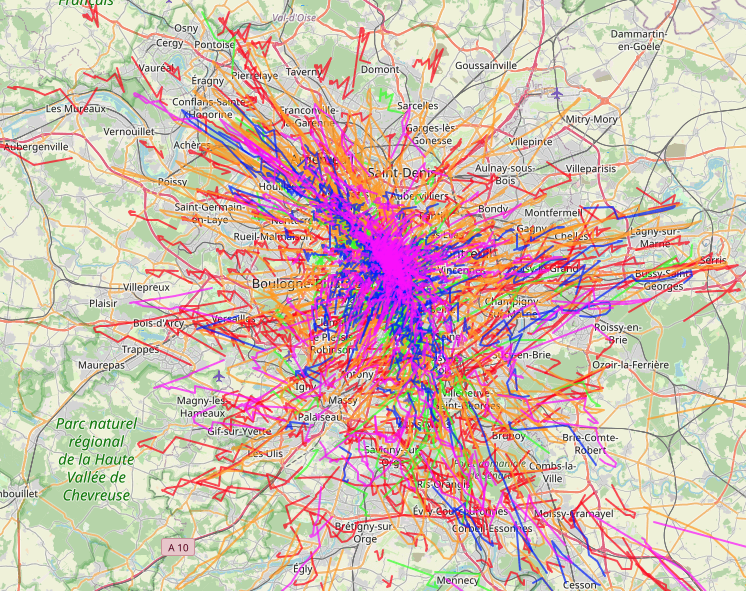

# ml_mobility_ns3

Trajectory generation models for mobility simulation.

## Installation

```bash
pip install -r requirements.txt
pip install -e .
```

## Part 1: Preprocess, Train, Evaluate Trajectory Generation

### Data Preprocessing

```bash
python scripts/preprocess.py data.data_dir=data/netmob25
```

### Training

```bash
python scripts/train.py model=vae_lstm training.epochs=100
```

### List Experiments
```bash
python scripts/list_experiments.py
```

### Evaluation

```bash
python scripts/evaluate.py +experiment_id=vae_dense_2025-07-14_16-14-23
```

### Generated Trajectories Example



*Example of generated trajectories showing the model's capability to produce realistic mobility patterns.*

### Configuration

All configurations are managed through Hydra. Default configs are in `configs/`.

### Model Selection

```bash
python scripts/train.py model=dummy training.epochs=3 accelerator=cpu # Use dummy model
python scripts/train.py model=vae_lstm  accelerator=gpu devices=[3] device=cuda # Use VAE-LSTM model

python scripts/train.py --config-path=configs/sweep --config-name=basic_grid --multirun
```

### Hyperparameter Tuning

```bash
python scripts/train.py model.hidden_dim=128 training.learning_rate=1e-3
```

## Part 2: Use Trajectory Generation Model in NS-3

### NS-3 Installation

First, check your OS version and install dependencies:

```bash
cat /etc/os-release
sudo apt install git g++ clang python3 python3-pip cmake ninja-build tcpdump wireshark
python3 -m pip install --user cppyy==3.1.2
```

Download and build NS-3:

```bash
tar -jxvf ns-3.45.tar.bz2
cd ns-3.45
./ns3 configure --enable-examples --enable-tests
./ns3 build
./test.py
./ns3 run hello-simulator
```

### Export Model for NS-3

Export your trained model for integration with NS-3:

```bash
python scripts/export.py +experiment_id=your_experiment_id path_model_path_experiment_to_import=path/to/your/model
```

Note: The export script directly integrates the model into NS-3 without requiring separate export files.

### Installation of the netmob25 Mobility Model in NS-3.45

Follow these steps to integrate the netmob25 mobility model:

1. **Copy model files:**
   ```bash
   cp netmob25-mobility-model.h ns-3.45/src/mobility/model/
   cp netmob25-mobility-model.cc ns-3.45/src/mobility/model/
   ```

2. **Update CMakeLists.txt:**
   Add `netmob25-mobility-model.h` and `netmob25-mobility-model.cc` to the CMakeLists.txt file in `ns-3.45/src/mobility/`

3. **Copy example file:**
   ```bash
   cp netmob25-mobility-example.cc ns-3.45/scratch/
   ```

4. **Recompile NS-3:**
   ```bash
   cd ns-3.45
   ./ns3 configure --enable-examples --enable-tests
   ./ns3 build
   ```

5. **Test the mobility model:**
   ```bash
   ./ns3 run scratch/netmob25-mobility-example.cc
   ```

### Usage in NS-3

Once installed, you can use the netmob25 mobility model in your NS-3 simulations to generate realistic mobility patterns based on your trained trajectory generation models.